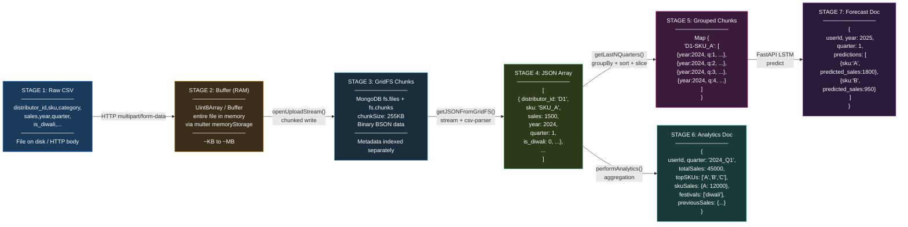
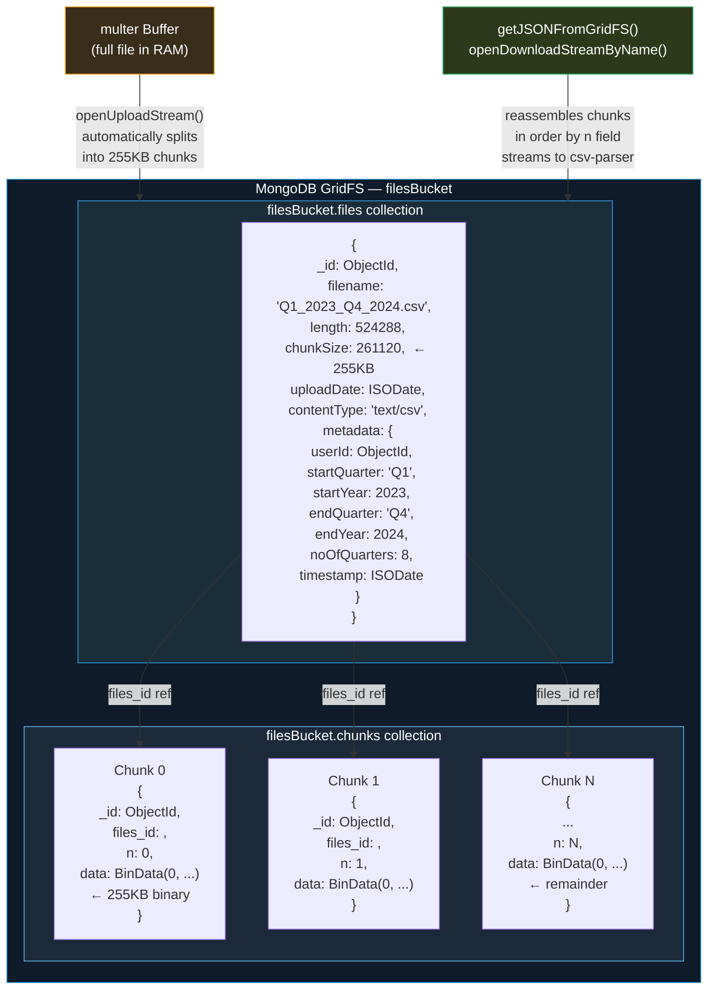
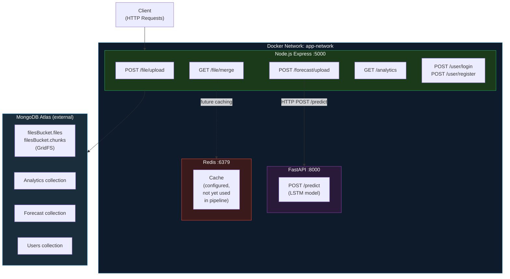

# Data Ingestion Pipeline — Demand Forecasting Backend

## Complete Flow Diagram

```mermaid
flowchart TD
    subgraph INPUT["INPUT DATA FORMAT"]
        A["CSV File\nFilename: Q1_2023_Q4_2024.csv\n─────────────────────\nColumns:\n• distributor_id\n• sku\n• category\n• sales (numeric)\n• year\n• quarter (1-4)\n• is_diwali / is_eid\n• is_ganesh_chaturthi\n• is_gudi_padwa\n• is_akshay_tritiya\n• is_dussehra_navratri\n• is_onam / is_christmas"]
    end

    subgraph ENTRY["ENTRY POINTS (Express Routes)"]
        B1["POST /file/upload\nfileRoutes.js:92\n(Persistent Storage + Analytics)"]
        B2["POST /forecast/upload\nforecastRoutes.js:33\n(Forecast Generation Only)"]
    end

    subgraph AUTH["AUTHENTICATION"]
        C["JWT Bearer Token\nauthMiddleware.js\nVerify & decode userId"]
    end

    subgraph RECEIVE["FILE RECEPTION"]
        D["multer — memoryStorage()\nFile buffered in RAM\nupload.single('file')"]
    end

    subgraph VALIDATE["VALIDATION LAYER"]
        E1["Filename Format Check\nfileRoutes.js:110-120\nMust match:\nQ{q}_{y}_Q{q}_{y}.csv\n4 parts when split by '_'"]
        E2["Duplicate File Check\nfileRoutes.js:101-108\nQuery GridFS for same\nfilename + userId combo"]
        E3["Extract Metadata\n• startQuarter / startYear\n• endQuarter / endYear\n• noOfQuarters =\n  (endYear-startYear)*4\n  + (endQ - startQ) + 1"]
    end

    subgraph GRIDFS_UPLOAD["GRIDFS UPLOAD (MongoDB)"]
        F["gridfsBucket.openUploadStream()\nfileRoutes.js:146-151\nBucket: 'filesBucket'\n─────────────────────\nMetadata Stored:\n• userId\n• startQuarter, startYear\n• endQuarter, endYear\n• noOfQuarters\n• timestamp\n• contentType"]
        F_EVT["uploadStream.on('finish')\nEvent trigger for\npost-upload processing"]
    end

    subgraph CSV_PARSE["CSV PARSING"]
        G1["getJSONFromGridFS(filename)\ncsvtoJson.js:4-33\nStream file from GridFS\n→ csv-parser\n→ JSON array of row objects"]
        G2["Readable.from(buffer)\nforecastRoutes.js:53\nIn-memory CSV parse\n→ csv-parser stream\n→ JSON row array"]
    end

    subgraph CHUNKING["DATA CHUNKING"]
        H["getLastNQuarters(rows)\nforecastRoutes.js:16-30\n─────────────────────\n1. Group rows by\n   distributor_id + sku\n2. Sort each group by\n   year → quarter\n3. Slice last N=4 quarters\n─────────────────────\nOutput: Map{\n  'dist1-SKU_A' → [Q1,Q2,Q3,Q4]\n  'dist1-SKU_B' → [Q1,Q2,Q3,Q4]\n  ...}\n"]
        H2["mergeUserCSVFiles(userId)\ncsvUtils.js:32-97\n─────────────────────\n1. Compute current quarter\n2. Look back 4 quarters\n3. Query GridFS for files\n   in that date range\n4. Stream + concat CSVs\n─────────────────────\nOutput: Combined CSV buffer"]
    end

    subgraph ANALYTICS_PROC["ANALYTICS PROCESSING"]
        I["performAnalytics(data)\nanalytics.js:1-71\n─────────────────────\nGroups by year_Q{quarter}\nFor each quarter computes:\n• totalSales (sum)\n• totalOrders (row count)\n• avgSalesPerOrder\n• topSKUs (top 3 by sales)\n• skuSales {sku: sales}\n• categorySales {cat: sales}\n• festivals detected (8 types)\n• previousSales (last 6 qtrs)"]
    end

    subgraph FASTAPI_CALL["ML SERVICE CALL"]
        J["POST /predict → FastAPI\nfastAPI/main.py\n─────────────────────\nPayload per group:\n{\n  distributor_id,\n  sku,\n  last_n_quarters: [\n    {sales, year, quarter,\n     festival_flags...}\n  ]\n}\n─────────────────────\nFastAPI processing:\n1. One-hot encode festivals\n2. Scale features\n3. Run LSTM model\n4. Return predicted_sales"]
    end

    subgraph STORAGE["STORAGE LAYER (MongoDB)"]
        K1["GridFS — filesBucket\n─────────────────────\nRaw CSV files stored as\nbinary chunks (255KB each)\nIndexed by filename + userId\nmetadata for range queries"]

        K2["Analytics Collection\nschema/Analytics.js\n─────────────────────\n• userId (ref: User)\n• quarter (e.g. '2024_Q1')\n• year (Number)\n• totalSales\n• totalOrders\n• avgSalesPerOrder\n• topSKUs []\n• skuSales {}\n• categorySales {}\n• festivals []\n• previousSales {}\n• createdAt / updatedAt"]

        K3["Forecast Collection\nschema/forecast.js\n─────────────────────\n• userId (ref: User)\n• year (Number)\n• quarter (Number)\n• predictions []\n  - sku (String)\n  - predicted_sales (Number)\n• createdAt / updatedAt"]

        K4["Users Collection\nschema/user.js\n─────────────────────\n• email (unique)\n• password (hashed)\n• fullName\n• isActive\n• createdAt / updatedAt"]
    end

    %% Main upload flow
    A --> B1
    A --> B2
    B1 --> C
    B2 --> C
    C --> D
    D --> E1
    E1 -->|valid| E2
    E1 -->|invalid| ERR1["400 Error\nInvalid filename format"]
    E2 -->|unique| E3
    E2 -->|duplicate| ERR2["409 Error\nFile already exists"]
    E3 --> F
    F --> K1
    F --> F_EVT

    %% Analytics path
    F_EVT --> G1
    G1 --> I
    I --> K2

    %% Forecast path
    B2 --> G2
    G2 --> CHUNKING
    H --> J
    J --> K3

    %% Merge path (used for forecast from stored files)
    K1 -.->|"GET /file/merge"| H2
    H2 -.-> H

    style INPUT fill:#1a3a5c,stroke:#4a9eff,color:#fff
    style ENTRY fill:#2d1b4e,stroke:#9b59b6,color:#fff
    style AUTH fill:#1a3a2d,stroke:#2ecc71,color:#fff
    style RECEIVE fill:#3a2d1a,stroke:#f39c12,color:#fff
    style VALIDATE fill:#3a1a1a,stroke:#e74c3c,color:#fff
    style GRIDFS_UPLOAD fill:#1a2d3a,stroke:#3498db,color:#fff
    style CSV_PARSE fill:#2d3a1a,stroke:#27ae60,color:#fff
    style CHUNKING fill:#3a1a3a,stroke:#e91e8c,color:#fff
    style ANALYTICS_PROC fill:#1a3a3a,stroke:#1abc9c,color:#fff
    style FASTAPI_CALL fill:#2a1a3a,stroke:#8e44ad,color:#fff
    style STORAGE fill:#1a1a3a,stroke:#2980b9,color:#fff
    style ERR1 fill:#5a1a1a,stroke:#e74c3c,color:#fff
    style ERR2 fill:#5a1a1a,stroke:#e74c3c,color:#fff
```

---

## Data Structure at Each Stage

---

## GridFS Chunking Internals

---

## Services Architecture

---

## Key File Reference

| File | Role | Critical Lines |
|------|------|---------------|
| `routes/fileRoutes.js` | Upload endpoint, validation, analytics trigger | 92–191 |
| `routes/forecastRoutes.js` | Forecast upload, chunking, FastAPI call | 16–90 |
| `utils/csvtoJson.js` | GridFS → JSON conversion | 4–33 |
| `utils/csvUtils.js` | Multi-file merge (4-quarter window) | 32–97 |
| `utils/analytics.js` | Quarterly metrics computation | 1–71 |
| `config/db.js` | MongoDB + GridFS bucket init | 1–20 |
| `schema/Analytics.js` | Analytics document schema | — |
| `schema/forecast.js` | Forecast document schema | — |
| `fastAPI/main.py` | LSTM prediction service | — |
